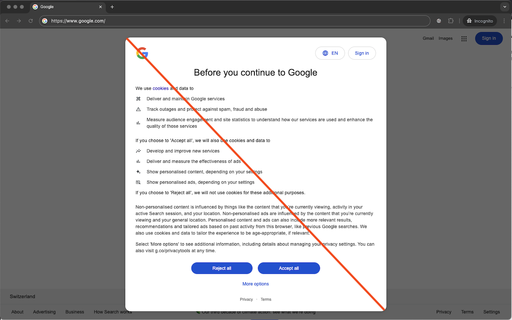
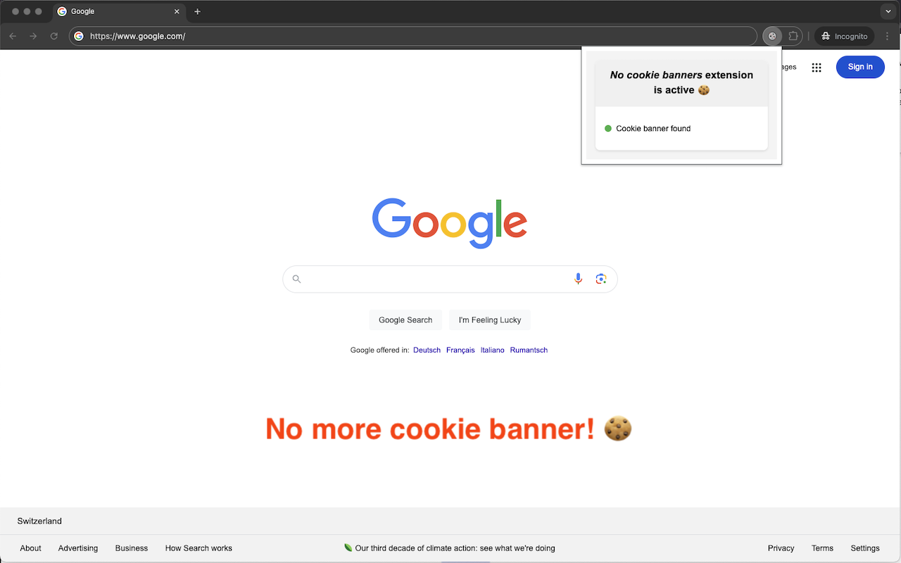

# No Cookie Banners Browser Extension

  
   

"No Cookie Banners" is browser extension to get rid of annoying cookie policy pop-ups.
Say goodbye to cookie warnings.
This extension tries to automatically deny all cookie requests whereas normally you would need to click "Refuse All Cookies".

The extension does not send any data to any service.
There is no company behind this extension to crawl your data.

Note: Due to technical constraints it is not possible to remove the cookie warnings in all cases on all websites.
For security reasons the browser doesn't allow to interact with iFrames from different domains.
Unfortunately, it is not possible as an extension to interact with cookie warning if it is embedded as an iFrame from a different domain.

The code for the extension is open-source.
Feel free to create feature requests or bug reports on this GitHub repository: https://github.com/JeannedArk/no-cookie-banners-browser-extension

## Sponsor 🙏

Like this project? **Leave a star**! ⭐

You want to support the active development of this project? 

## Debugging

Those URLs are helpful to debug the extension:
- `chrome://inspect/#service-workers`
- `chrome://serviceworker-internals/?devtools`